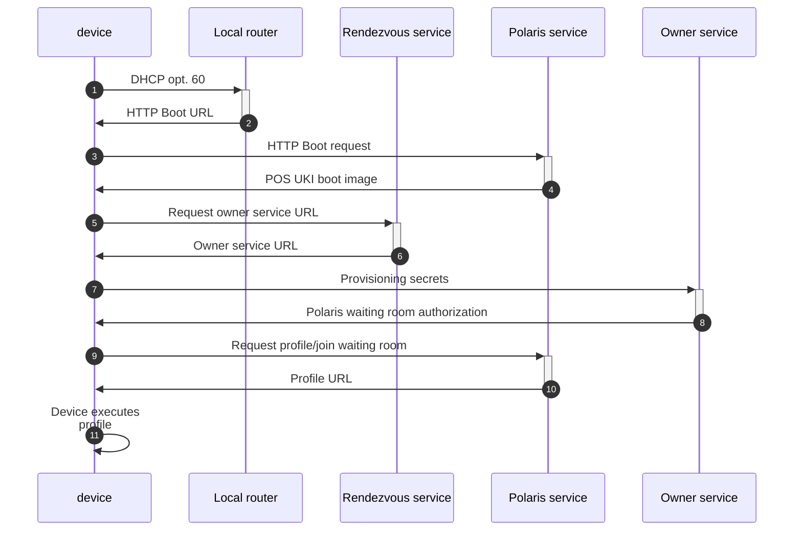

docker exec -it polaris-mysql-1 bash
mysql -u root -p
docker compose up
docker compose up --detach
curl polaris-service:8000/devices
mysql -h mysql -u root -p
mysql -h localhost --protocol tcp -u root -p #uses TCP instead of unix socket

